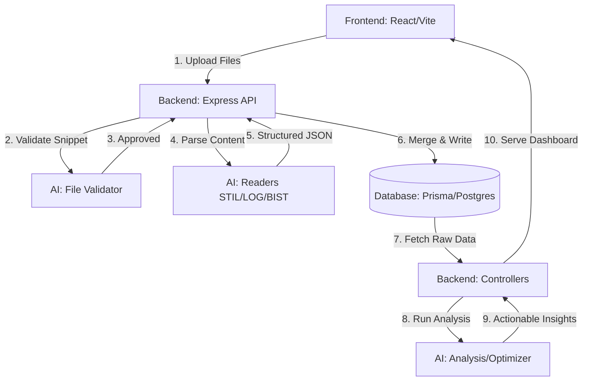

# ATE Intelligence: System Architecture & Data Flow

This document details the end-to-end "Connecting Flow" of the ATE Intelligence platform, showing how the Frontend, Backend, AI Models, and Database interact.

## 1. High-Level Architecture

---

## 2. The Lifecycle of an Uploaded File

### Step 1: Frontend Submission
The user selects files (e.g., `test_results.log`, `design.stil`) in the `UploadBox` component. The frontend sends a `POST /api/upload/parse` request with a `FormData` object containing the files.

### Step 2: Backend Gatekeeping (`modelSelector.service.ts`)
The backend does **not** parse the file immediately. It sends the first 2000 characters to the **File Validator AI Model**. 
- If the AI detects a "Fake" or "Corrupt" file, the process stops, and an error is streamed back to the user via Server-Sent Events (SSE).
- If "Valid", the validator returns the `DetectedType` (e.g., `ATE_LOG`).

### Step 3: AI Parsing (`ai-models/readers/`)
Based on the `DetectedType`, the system selects the correct reader:
- **Phase 1**: The reader uses high-speed Regex to extract 80-90% of the data (Deterministic).
- **Phase 2**: If the format is non-standard, **Claude 3.5 Sonnet** is called to "fill in the gaps" (Enrichment).

### Step 4: Database Ingestion (`importService.ts`)
The structured JSON from the readers is passed to the `mergeAndImport` service. This service:
- Normalizes coordinates.
- Maps pattern IDs across STIL and Log files.
- Writes records into the PostgreSQL database using Prisma ORM.

---

## 3. The Analysis Flow (Post-Import)

When the user views a dashboard tab (e.g., **Scan Chain** or **Cost Optimizer**):

1.  **Frontend Request**: The browser requests `GET /api/dashboard/patterns?lotId=...`.
2.  **Controller Logic**: The `dashboardController` fetches raw data from the DB.
3.  **AI Analysis**: The backend calls the `analyzePatterns` or `optimizeCost` models.
4.  **ROI Calculation**: These models run deterministic math (ROI, Redundancy check) and use Claude to generate the human-readable "Insights" shown in the UI.

---

## 4. Key Connection Points

| Layer | Connection Method | Responsibilty |
| :--- | :--- | :--- |
| **Frontend → Backend** | HTTP / Axios + SSE | UI interaction and real-time status |
| **Backend → AI Models** | Local Workspace Import | Orchestration and Data contract |
| **AI Models → Anthropic** | HTTPS / SDK | Deep semantic analysis (Claude 3.5) |
| **Backend → Database** | Prisma Client | Persistence and Relational integrity |

## 5. Verification Check
To verify the flow is connected:
1.  **Check Terminal**: Ensure both `frontend` and `backend` are running.
2.  **Environment**: Ensure `ANTHROPIC_API_KEY` is present in your `.env`.
3.  **SSE Logs**: When uploading, check the "Network" tab in your browser for the `stream` events—this confirms the AI models are talking to the backend.
